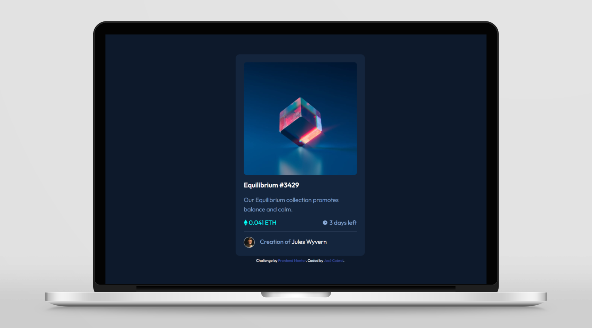

# Frontend Mentor - NFT preview card component solution

This is a solution to the [NFT preview card component challenge on Frontend Mentor](https://www.frontendmentor.io/challenges/nft-preview-card-component-SbdUL_w0U). Frontend Mentor challenges help you improve your coding skills by building realistic projects.

## Table of contents

- [Overview](#overview)
  - [The challenge](#the-challenge)
  - [Screenshot](#screenshot)
  - [Links](#links)
- [My process](#my-process)
  - [Built with](#built-with)
- [Author](#author)

## Overview

### The challenge

Users should be able to:

- View the optimal layout depending on their device's screen size
- See hover states for interactive elements

### Screenshot

### Links

- Solution URL: [Add solution URL here](https://github.com/jlmcabral/frontendmentor.io-challenges/tree/main/tailwind-nft-preview)
- Live Site URL: [Add live site URL here](https://jlmcabral-tailwind-nft-preview.netlify.app/)

## My process

### Built with

- Semantic HTML5 markup
- CSS custom properties
- Flexbox
- Mobile-first workflow
- [Angular](https://angular.io/) - TS framework
- [Tailwind](https://tailwindcss.com/) - For styles

## Author

- Frontend Mentor - [@jlmcabral](https://www.frontendmentor.io/profile/jlmcabral/)
- LinkedIn - [LinkedIn Profile](https://www.linkedin.com/in/jos%C3%A9-cabral/)
